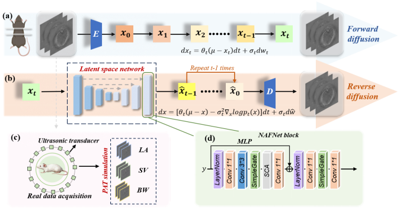

## Figure 1



**Figure 1.** Algorithmic flowchart of the proposed latent diffusion-based photoacoustic image reconstruction framework. This framework encompasses the forward diffusion process and reverse diffusion process operating in the latent space, along with the corresponding real-world data acquisition and simulation pipeline for photoacoustic tomography (PAT). The forward diffusion process encodes the original image into latent variables and gradually introduces noise, while the reverse diffusion process iteratively denoises the latent variables to reconstruct the final image. The data pipeline simulates PAT data acquisition via an ultrasonic transducer array and generates datasets with different quality levels. The latent space network incorporates a NAFNet block structure to enable efficient feature extraction and denoising during the reconstruction.
## Figure 2


**Figure 2.** Summary of reconstruction process and the corresponding metric trends. Panels (a1)–(a5), (b1)–(b5), and (c1)–(c5) show snapshots of the proposed method from Step 1 to Step 100 under three acquisition constraints—bandwidth-limited (BW), limited-angle (LA), and sparse-view (SV), respectively; panels (d), (e), and (f) plot PSNR and SSIM versus the iteration steps for the three corresponding scenarios.

# Refusion-PAT

This repository contains the code used in our paper:

**Refusion-PAT: A Latent Diffusion Framework for Robust Photoacoustic Tomography Reconstruction under Extreme Acquisition Constraints**

## Overview

Photoacoustic tomography (PAT) often suffers from severe image degradation under constrained acquisition conditions, such as limited-angle detection, sparse-view sampling, and bandwidth limitation. To address these challenges, we adapt the Refusion latent-space diffusion framework to PAT reconstruction and evaluate it on in vivo mouse data.

This repository provides the code used for the following PAT reconstruction settings:

- Limited-angle reconstruction
- Sparse-view reconstruction
- Bandwidth-limited reconstruction

## Important Note on Code Origin

This repository is built upon the open-source Refusion / IR-SDE codebase rather than being an independent implementation from scratch.

We only used and adapted the Refusion training and testing pipeline for the PAT reconstruction task. Our modifications are mainly related to:

- PAT data organization and preprocessing
- PAT-specific experimental settings
- reproduction of the results reported in our paper

The original repository is the open-source Refusion / IR-SDE project by Ziwei Luo, Fredrik K. Gustafsson, Zheng Zhao, Jens Sjölund, and Thomas B. Schön.

This repository is intended for academic research and experimental reproduction of our PAT work.

## License

This project includes code derived from the original Refusion / IR-SDE repository, which is released under the MIT License.

Please keep the original `LICENSE` file in this repository.

If you use, modify, or redistribute this repository, please comply with the terms of the MIT License and properly acknowledge the original authors.

## Environment

Recommended environment:

- Ubuntu 20.04
- Python 3
- PyTorch >= 1.13.0
- CUDA 11.7
- cuDNN 8.5.0

Install dependencies with:

```bash
pip install -r requirements.txt
```

## Dataset Preparation

The PAT dataset used in our paper consists of in vivo mouse images under three constrained acquisition settings:

- Limited-angle: 45°, 90°, 135°, 180°
- Sparse-view: 8, 16, 32, 64 views
- Bandwidth-limited: 6.25%, 12.5%, 25%, 50%

Please organize the PAT data into paired low-quality and ground-truth folders. A typical directory structure is:

```bash
datasets/PAT/train/GT
datasets/PAT/train/LQ
datasets/PAT/test/GT
datasets/PAT/test/LQ
```

Then modify the dataset paths in the corresponding option files before training or testing.

## Training

This repository uses the original Refusion training entry with the original directory structure.

```bash
cd codes/config/deraining

# single GPU
python3 train.py -opt=options/train/refusion.yml
```

For distributed training:

```bash
python3 -m torch.distributed.launch --nproc_per_node=2 train.py -opt=options/train/refusion.yml --launcher pytorch
```

## Testing

Use the original testing entry with the corresponding Refusion option file:

```bash
cd codes/config/deraining
python test.py -opt=options/test/refusion.yml
```

## Experimental Settings

The experiments in our paper cover three representative constrained-acquisition scenarios in PAT.

### 1. Limited-angle reconstruction
- 45°
- 90°
- 135°
- 180°

### 2. Sparse-view reconstruction
- 8 views
- 16 views
- 32 views
- 64 views

### 3. Bandwidth-limited reconstruction
- 6.25%
- 12.5%
- 25%
- 50%

## Citation

If you find this repository helpful for your research, please cite our paper:

```bibtex
@article{refusion_pat,
  title={Refusion-PAT: A Latent Diffusion Framework for Robust Photoacoustic Tomography Reconstruction under Extreme Acquisition Constraints},
  author={Pu, Zeyi and Wang, Sihui and Tong, Fangjia and Liao, Huiru and Wang, Ziyang and Liu, Qiegen and Song, Xianlin},
  journal={Under review},
  year={2026}
}
```

Please also cite the original Refusion / IR-SDE papers:

```bibtex
@article{luo2023image,
  title={Image Restoration with Mean-Reverting Stochastic Differential Equations},
  author={Luo, Ziwei and Gustafsson, Fredrik K and Zhao, Zheng and Sj{\"o}lund, Jens and Sch{\"o}n, Thomas B},
  journal={International Conference on Machine Learning},
  year={2023}
}

@inproceedings{luo2023refusion,
  title={Refusion: Enabling Large-Size Realistic Image Restoration with Latent-Space Diffusion Models},
  author={Luo, Ziwei and Gustafsson, Fredrik K and Zhao, Zheng and Sj{\"o}lund, Jens and Sch{\"o}n, Thomas B},
  booktitle={Proceedings of the IEEE/CVF Conference on Computer Vision and Pattern Recognition Workshops},
  pages={1680--1691},
  year={2023}
}
```

## Acknowledgement

This work is built upon the open-source Refusion / IR-SDE framework. We sincerely thank the original authors for making their code publicly available.

## Disclaimer

This repository is an academic research codebase for reproducing the PAT experiments reported in our paper.

It is adapted from the original Refusion implementation and is not the official repository of the original authors.